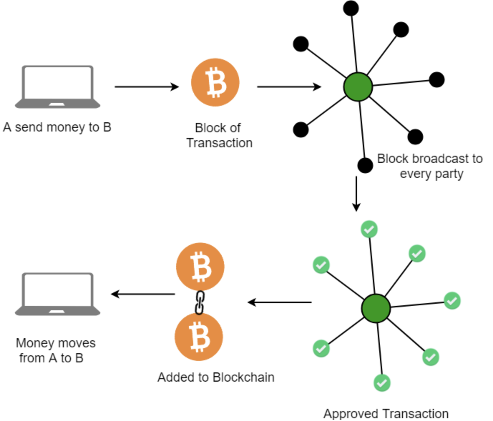

# Blockchain: A Primer for Beginners
### How It Works and Why It Matters

---

**What is blockchain?**

* A blockchain is a distributed database that maintains a continuously growing list of records called blocks.
[Image of Blockchain diagram]
* Each block contains a number of transactions, and every time a new transaction occurs on the blockchain, a record of that transaction is added to every participant's ledger.
* The decentralized database managed by multiple participants is known as Distributed Ledger Technology (DLT). Blockchain is a type of DLT in which transactions are recorded with an immutable cryptographic signature called a hash.
* Blockchains are typically used as a secure and transparent way to record transactions and track assets.

**How does blockchain work?**

* A blockchain is a chain of blocks, each of which contains a number of transactions.
* When a new transaction occurs, it is added to a block.
* The block is then encrypted and linked to the previous block in the chain.
* This process continues, creating a chain of blocks that cannot be tampered with or altered.
* To add a new block to the chain, a miner must solve a complex mathematical problem.
* The miner who solves the problem first is rewarded with a cryptocurrency, such as Bitcoin.
* Once a block is added to the chain, it is visible to all participants in the network.
* This ensures that all participants have access to the same information and that the blockchain is tamper-proof.

**Benefits of blockchain**

* **Security:** Blockchain is a very secure way to store data.
* **Transparency:** Blockchain is a transparent way to track transactions.
* **Immutability:** Blockchain is an immutable way to store data.
* **Efficiency:** Blockchain can be more efficient than traditional methods of record-keeping.
* **Cost-effectiveness:** Blockchain can be more cost-effective than traditional methods of record-keeping.

---
{!inpage-ads.md!}
---

**Potential applications of blockchain**

* **Finance:** Blockchain can be used to track financial transactions, such as payments and loans.
[Image of Finance blockchain diagram]
* **Supply chain management:** Blockchain can be used to track the movement of goods and materials through a supply chain.
[Image of Supply chain management blockchain diagram]
* **Healthcare:** Blockchain can be used to track patient records and medical data.
[Image of Healthcare blockchain diagram]
* **Government:** Blockchain can be used to track government records and transactions.
* **Real estate:** Blockchain can be used to track real estate transactions.
* **Intellectual property:** Blockchain can be used to track intellectual property rights.

**Challenges of blockchain**

* **Complexity:** Blockchain is a complex technology.
* **Scalability:** Blockchain can be difficult to scale to large numbers of participants.
* **Regulation:** Blockchain is a new technology, and there is limited regulation around its use.
* **Security:** Blockchain is a secure technology, but it is not immune to attack.

**Conclusion**

Blockchain is a promising new technology with the potential to revolutionize many industries. However, it is important to remember that blockchain is still in its early stages of development, and there are some challenges that need to be addressed before it can be widely adopted.

Overall, blockchain is a powerful tool that can be used to improve security, transparency, and efficiency. It has the potential to revolutionize many industries, but it is important to use it responsibly and ethically.

---

{!articles_foot.md!}
